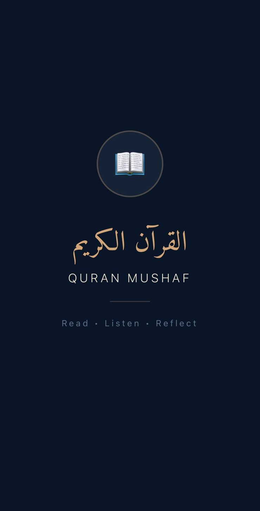
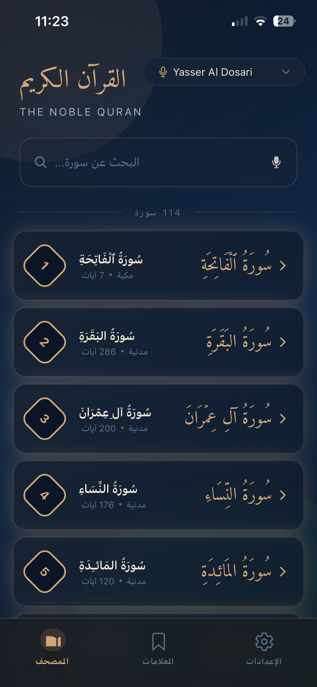
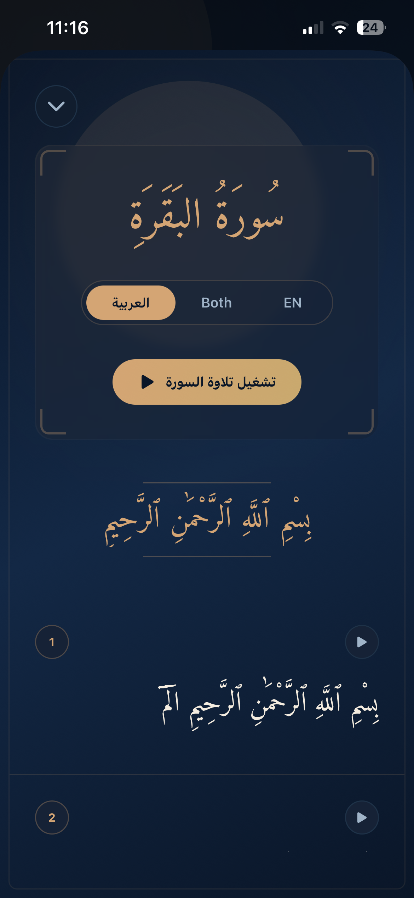
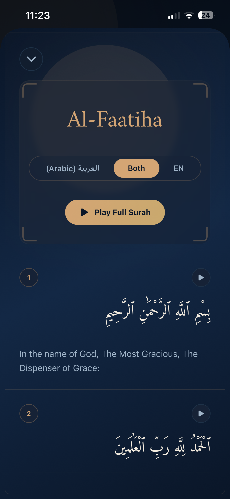
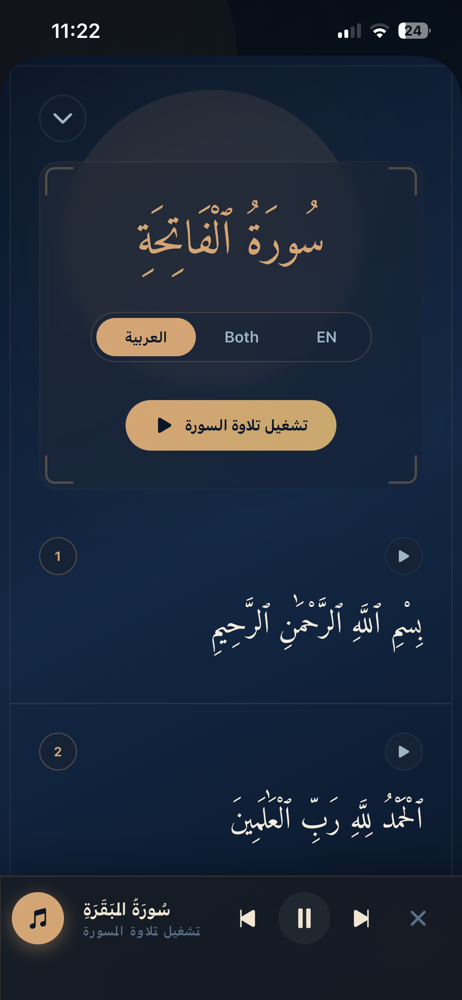
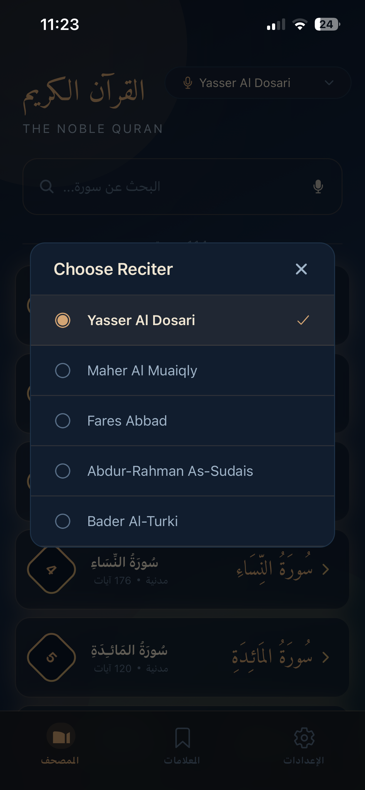

<div align="center">



# ﷽

# Quran Mushaf — القرآن الكريم

### Read · Listen · Reflect

A beautifully crafted mobile Quran application with immersive audio recitations, modern glassmorphism UI, and full Arabic–English bilingual support.

[](https://reactnative.dev)
[](https://expo.dev)
[](https://typescriptlang.org)
[](https://expo.dev)

</div>

---

## 📱 Screenshots

<div align="center">
<table>
<tr>
<td align="center"><b>Home — Surah List</b></td>
<td align="center"><b>Surah Reading (Arabic)</b></td>
<td align="center"><b>Bilingual Mode</b></td>
</tr>
<tr>
<td></td>
<td></td>
<td></td>
</tr>
<tr>
<td align="center"><b>Audio Player</b></td>
<td align="center"><b>Reciter Selection</b></td>
<td align="center"><b>Splash Screen</b></td>
</tr>
<tr>
<td></td>
<td></td>
<td></td>
</tr>
</table>
</div>

---

## ✨ Features

<table>
<tr>
<td width="50%">

### 📖 Reading Experience
- All **114 Surahs** with full Arabic text
- **Bilingual mode** — Arabic only, English only, or both side-by-side
- Beautiful **Amiri calligraphy** for authentic Quranic script
- **Bismillah header** elegantly styled at the start of each Surah
- Per-verse numbering with clean card layout

</td>
<td width="50%">

### 🎧 Audio Player
- **Full Surah recitation** streaming from trusted sources
- **Spotify-style full-screen player** with cover art
- **Smooth draggable seek bar** — scrub through recitation by the second
- Play, pause, stop, skip forward/backward controls
- **Per-verse audio** — tap any ayah to hear it recited
- Persistent mini-player across all screens

</td>
</tr>
<tr>
<td width="50%">

### 🎙️ Multiple Reciters
- **Yasser Al-Dosari**
- **Maher Al-Muaiqly**
- **Abdur-Rahman As-Sudais**
- **Fares Abbad**
- **Bader Al-Turki**
- Auto-reset playback when switching reciters

</td>
<td width="50%">

### 🌍 Bilingual Interface
- Full **Arabic & English** UI support
- Switch language instantly from Settings
- **Smart Arabic search** — ignores diacritics, handles Alif variants, Teh Marbuta, and the "سورة" prefix
- Surah names displayed in both scripts

</td>
</tr>
<tr>
<td width="50%">

### 🎨 Modern Design
- **Glassmorphism** with blur and gradient effects
- Deep navy & warm gold Islamic-inspired color palette
- Floating translucent player bar & tab navigation
- Safe Area aware — supports notches, home indicators, Dynamic Island

</td>
<td width="50%">

### ⚡ Performance
- **Intelligent API caching** for instant browsing
- Background audio playback support
- Lightweight Zustand state management
- Smooth 60fps animations and transitions

</td>
</tr>
</table>

---

## 🔧 Tech Stack

| Layer | Technology |
|:--|:--|
| **Framework** | [React Native](https://reactnative.dev) 0.81 |
| **Toolchain** | [Expo SDK 52](https://expo.dev) + EAS Build |
| **Language** | TypeScript |
| **Audio Engine** | `expo-audio` with streaming & background playback |
| **Navigation** | React Navigation (Bottom Tabs + Native Stack) |
| **State** | [Zustand](https://github.com/pmndrs/zustand) |
| **Visual Effects** | `expo-blur` · `expo-linear-gradient` |
| **Typography** | [Amiri](https://fonts.google.com/specimen/Amiri) (Arabic calligraphic font) |
| **Safe Areas** | `react-native-safe-area-context` |
| **APIs** | [Al Quran Cloud](https://alquran.cloud/api) · [MP3Quran](https://mp3quran.net) · [EveryAyah](https://everyayah.com) |

---

## 📁 Project Structure

```
src/
├── components/        # SurahCard, AyahCard, AudioPlayerBar, ReciterPicker
├── constants/         # Theme tokens, translations, API endpoints
├── context/           # AudioContext, LanguageContext providers
├── hooks/             # Custom hooks (Arabic normalization, etc.)
├── navigation/        # Stack & Tab navigator configuration
├── screens/           # HomeScreen, SurahDetailScreen, Settings, Bookmarks
├── services/          # API service layer with caching
├── store/             # Zustand audio store
├── styles/            # Extracted StyleSheet modules
└── types/             # TypeScript interfaces & type definitions
```

---

## 🚀 Getting Started

### Prerequisites

- **Node.js** ≥ 18
- [Expo Go](https://expo.dev/client) on your iOS/Android device, or a local emulator

### Installation

```bash
# Clone the repository
git clone https://github.com/aminammar1/quran-app-react-native.git
cd quran-app-react-native

# Install dependencies
npm install

# Start the development server
npx expo start -c
```

Scan the QR code with **Expo Go** to launch the app on your device.

### Build APK

```bash
# Install EAS CLI
npm install -g eas-cli

# Build Android APK
npx eas-cli build -p android --profile preview
```

---

## 🛣️ Roadmap

- [ ] Bookmarks & reading progress tracking
- [ ] Offline surah downloads
- [ ] Additional translations (Urdu, French, Bengali)
- [ ] Word-by-word audio highlighting
- [ ] Prayer time integration
- [ ] Dark/Light theme toggle

---

## 🤝 Contributing

Contributions are welcome! Feel free to open issues or submit pull requests.

1. Fork the repository
2. Create your feature branch (`git checkout -b feature/amazing-feature`)
3. Commit your changes (`git commit -m 'Add amazing feature'`)
4. Push to the branch (`git push origin feature/amazing-feature`)
5. Open a Pull Request

---

## 📄 License

This project is open source and available under the [MIT License](LICENSE).

---

<div align="center">

### بِسْمِ اللَّهِ الرَّحْمَنِ الرَّحِيمِ

*Made for the sake of Allah ﷻ*

*May this app be a source of benefit for the Ummah*

</div>
